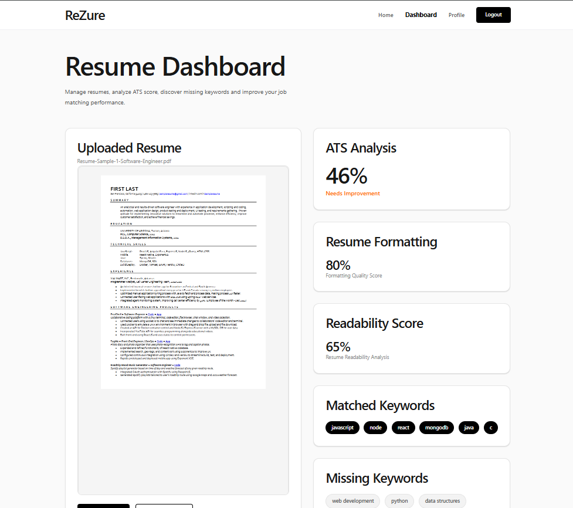
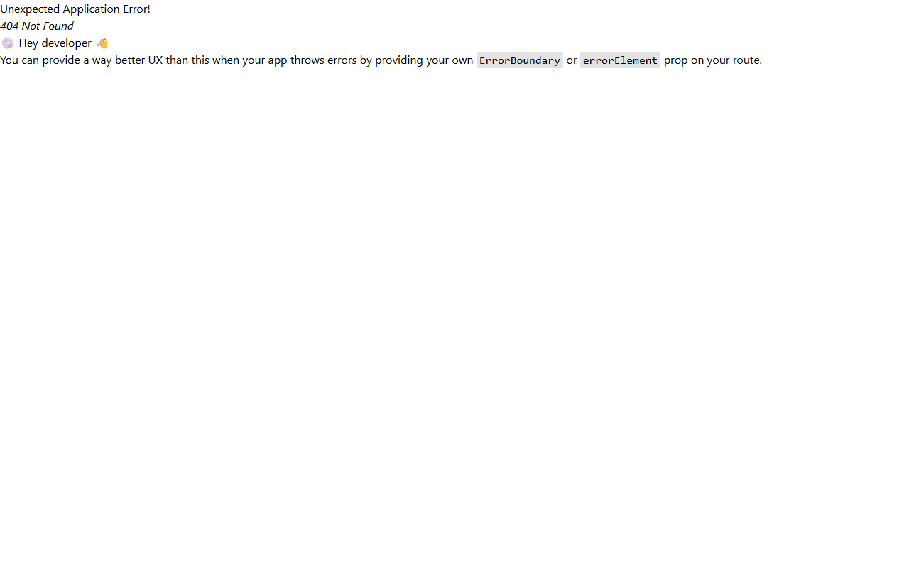
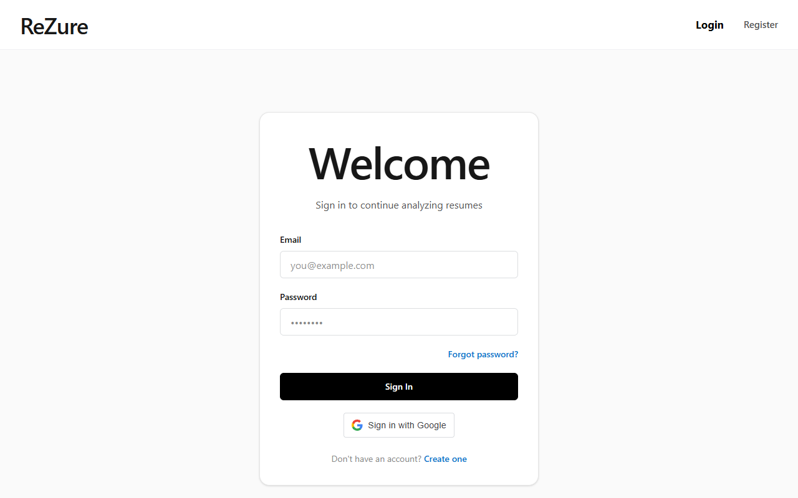
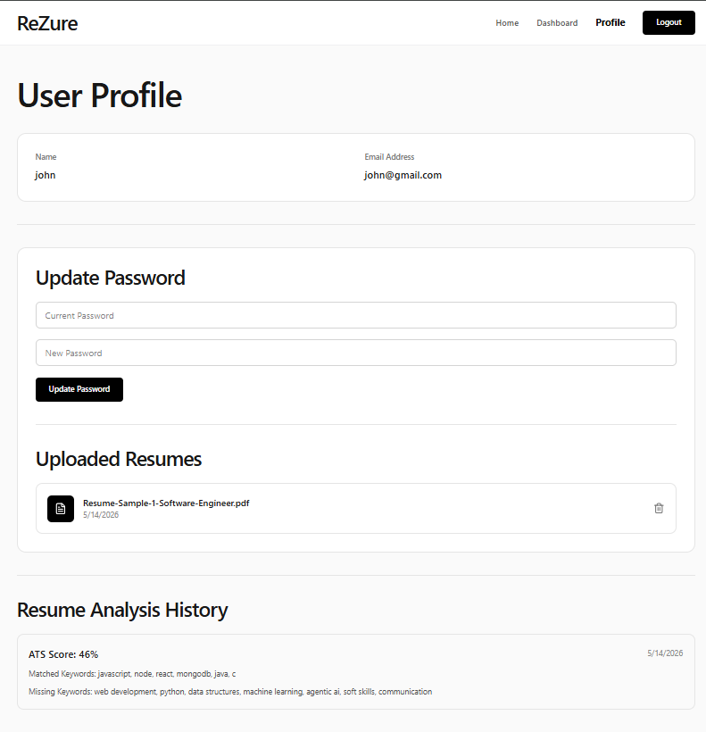

<div align="center">

# 🚀 AI Resume Analyser

> **Elevate your career with intelligent resume optimization and precise ATS job matching.**

An advanced, full-stack application designed to help job seekers bypass Applicant Tracking Systems (ATS). By leveraging cutting-edge NLP and AI technologies, this platform evaluates your resume against specific Job Descriptions (JDs), providing actionable insights and dynamically generating a personalized study plan to bridge your skill gaps.

[](#)
[](#)
[](#)
[](#)
[](#)
[](#)

</div>

---

## 🌟 Unique Feature: The AI Improvement Pipeline & ATS Matcher

Front and center to our application is the **AI-Powered ATS Job Match & Study Plan Pipeline**. 

Unlike standard resume parsers, our system does more than just extract text. It uses **Natural Language Processing (NLP)** to intelligently tokenize and clean your resume and the target Job Description. 

1. **Precision ATS Scoring:** Calculates an exact match percentage based on required technical keywords.
2. **Skill Gap Analysis:** Identifies the precise skills you are missing from the JD.
3. **AI Study Plan Generator:** Integrates with OpenAI to dynamically generate a customized, step-by-step study plan focusing exclusively on the skills you lack, ensuring you're interview-ready in record time.

---

## 📸 Application Screenshots

*(Replace the placeholder image links below with your actual Vercel/live deployment screenshots!)*

### 1. The Dashboard & ATS Score Analysis
> *Upload your resume, paste the JD, and instantly see your ATS match score alongside matched/missing skills.*


### 2. Personalized AI Study Plan
> *An AI-generated roadmap tailored to help you learn the skills missing from your resume.*


### 3. User Authentication & Profile
> *Secure JWT & Google OAuth authentication keeping your resume history safe.*


### 4. Resume History & Analytics
> *Track your previous resume submissions and watch your ATS scores improve over time.*


---

## ✨ Core Features

- **📄 Document Parsing Engine:** Supports robust extraction from `.pdf` and `.docx` files using `pdf-parse` and `mammoth`.
- **🧠 Natural Language Processing:** Utilizes `natural` and `stopword` libraries to tokenize, clean, and accurately match technical keywords.
- **🔐 Secure Authentication:** Full Google OAuth integration alongside traditional JWT-based email/password authentication.
- **☁️ Cloud Storage:** Secure resume document storage using Firebase and Cloudinary.
- **⚡ Blazing Fast UI:** Built with React, Vite, and styled with Tailwind CSS for a fully responsive, modern experience.
- **📊 Interactive Previews:** Preview your documents directly in the browser using `react-pdf` and `docx-preview`.

---

## 🛠️ Tech Stack

### Frontend
- **React.js** (v19) + **Vite**
- **Tailwind CSS** for responsive styling
- **Zustand** for lightweight global state management
- **React Router** for seamless navigation
- **React Hot Toast** for beautiful notifications

### Backend
- **Node.js** & **Express.js**
- **MongoDB** with **Mongoose** (Database)
- **OpenAI API** (For AI Study Plan Generation)
- **JSON Web Tokens (JWT)** & **Bcrypt** (Security)

---

## 🚀 Getting Started

Follow these instructions to set up the project locally on your machine.

### 1. Clone the repository
```bash
git clone https://github.com/amulyamandala/AI-Resume-Analyser.git
cd AI-Resume-Analyser
```

### 2. Backend Setup
```bash
cd backend
npm install
```
Create a `.env` file in the `backend` directory with the following keys:
```env
PORT=5000
MONGODB_URI=your_mongodb_connection_string
JWT_SECRET=your_jwt_secret
OPENAI_API_KEY=your_openai_api_key
CLOUDINARY_CLOUD_NAME=your_cloud_name
CLOUDINARY_API_KEY=your_cloudinary_api_key
CLOUDINARY_API_SECRET=your_cloudinary_api_secret
```
Start the backend server:
```bash
npm run dev
# or
node server.js
```

### 3. Frontend Setup
Open a new terminal window:
```bash
cd frontend
npm install
```
Create a `.env` file in the `frontend` directory with your Firebase/Google OAuth keys if required by your setup:
```env
VITE_API_URL=http://localhost:5000
```
Start the development server:
```bash
npm run dev
```

---

## 💡 How It Works (The Logic)

1. **Input:** The user uploads a Resume and provides a Job Description.
2. **Extraction:** The backend extracts raw text from the file (PDF/Word).
3. **NLP Processing:** Text is tokenized, converted to lowercase, and stop words (like "and", "the") are removed.
4. **Keyword Matching:** The cleaned resume text is compared against a comprehensive array of technical keywords found in the cleaned JD.
5. **Scoring:** The system calculates `(Matched Keywords / Total JD Keywords) * 100` to yield the ATS Score.
6. **Action:** The missing skills are sent to OpenAI to formulate a specific, actionable study plan for the user.

---

## 🤝 Contributing

Contributions, issues, and feature requests are welcome! Feel free to check the [issues page](#).

1. Fork the project.
2. Create your feature branch (`git checkout -b feature/AmazingFeature`).
3. Commit your changes (`git commit -m 'Add some AmazingFeature'`).
4. Push to the branch (`git push origin feature/AmazingFeature`).
5. Open a Pull Request.

---

<div align="center">
  <p>
    Built by 
    <a href="https://github.com/amulyamandala">Sri Amulya Mandala</a> •
    <a href="https://github.com/JoyceHanan">Joyce Hanan Marri</a> •
    <a href="https://github.com/rithvika-dev">Rithvika</a> •
    <a href="https://github.com/sreemaye-2006">Sreemaye</a> •
    <a href="https://github.com/KrishnaveniKovoor">Krishnaveni Kovoor</a>
  </p>
</div>
